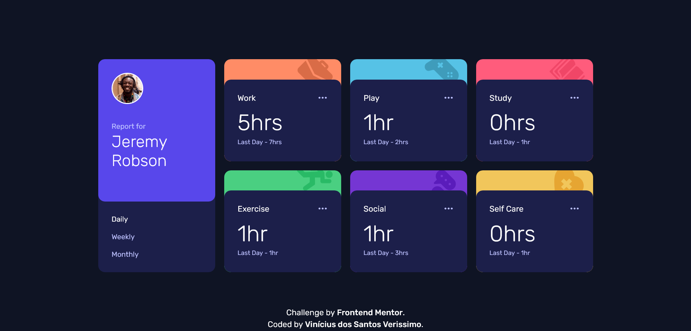

# Frontend Mentor - Time tracking dashboard solution

## Overview

### Screenshot

### Links

- Solution URL: Working on it.

## My process

### Built with

- Semantic HTML5 markup
- CSS custom properties
- Flexbox
- Grid
- Media Queries
- JavaScript

### What I learned

In this project i could use use media queries to adapt the containers according to the screen's width and position the elements using flexbox and CSS grid.

Also, i could use JavaScript to change the card's content according to the selected option in the menu. The user can choose bewteen "daily", "weekly" or "monthly" and see the hours spent on each activity.

## Author

- GitHub - Vinícius dos Santos Verissimo (https://github.com/viniciusdsv93)
